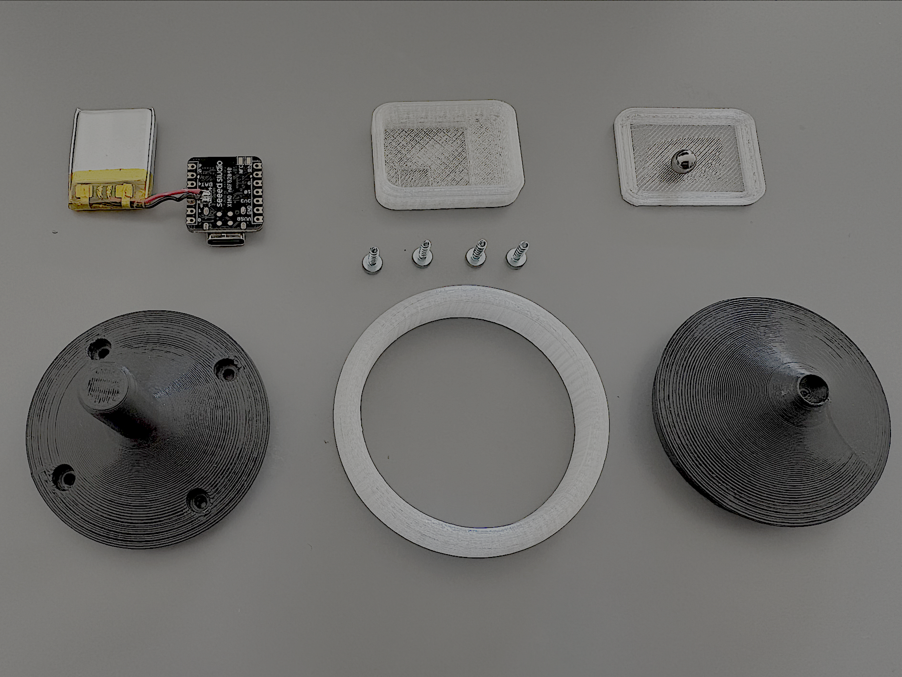
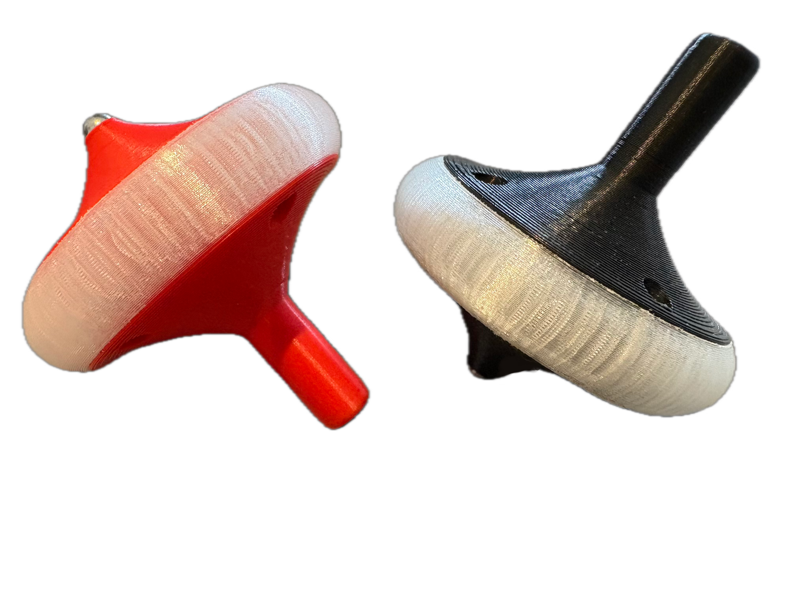

# SpinDuelApp

SpinDuel — The Ultimate Spin Challenge! Compete with friends to see who spins the longest! SpinDuel tracks your spin time with precision sensors and shares your results live via Bluetooth. Challenge yourself — Beat the record — Spin smarter!

# Build Instructions

Welcome to the SpinDuel project! This guide will walk you through building your own DIY spinner top for use with the SpinDuel app.

## What You’ll Need

- 1x Seeed XIAO nRF52840 Sense  
- 1x LiPo Battery 3.7V, minimum 200mAh (type 502025 recommended)  
- 4x Device Screws M2x8mm Hex  
- 1x Steel Ball 6mm  
- 3D printed parts (PLA+ or PETG)  

## Step-by-Step Instructions

### 1. Download Required Files

- Spinner Firmware uf2-file: [Download firmware](https://github.com/SmonSE/SpinDuelApp/tree/main/firmware)  
- 3D Printer STL files: [Download 3D models](https://www.printables.com/...)  

### 2. 3D Print the Parts

Use your 3D printer with the following settings or use the sliced download files to print

- **Infill:** 25% - 30%  
- **Layer height:** 0.2 mm  
- **Supports:** Yes (grid recommended)  
- **Filament:** PLA/PLA+ or PETG  
- **Estimated print time:** ~2 hours  

### 3. Flash the Firmware

1. Connect the XIAO nRF52840 Sense to your computer.  
2. Press and hold the **boot button** on the board.  
3. A USB drive will appear on your computer.  
4. Copy the `firmware.uf2` file to the USB drive.  

### 4. Assemble the Hardware

- Solder the LiPo battery to the `+` and `-` pins on the back of the board.  
- Double-check the **polarity** – incorrect wiring may damage the device.  
- Use a 3.7V LiPo battery with at least 200mAh capacity.  
- Mount the board and components using the printed parts and screws.  

---

## App & Links

- Android APK: [Download the SpinDuel App](https://example.com/spinduel.apk)  
- GitHub Repository: [View Source Code](https://github.com/dein-repo/spinduel)

---

## About SpinDuel

SpinDuel is an interactive game where you compete based on how high and fast your custom spinner top spins. The app connects via Bluetooth to measure spin time and performance.

Developed by **Simone Eisele**.

---

Feel free to open an issue if you run into problems or have improvement suggestions. Happy building and spinning!
